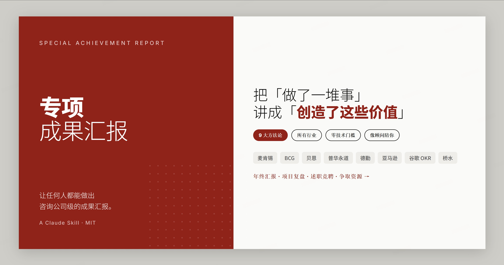
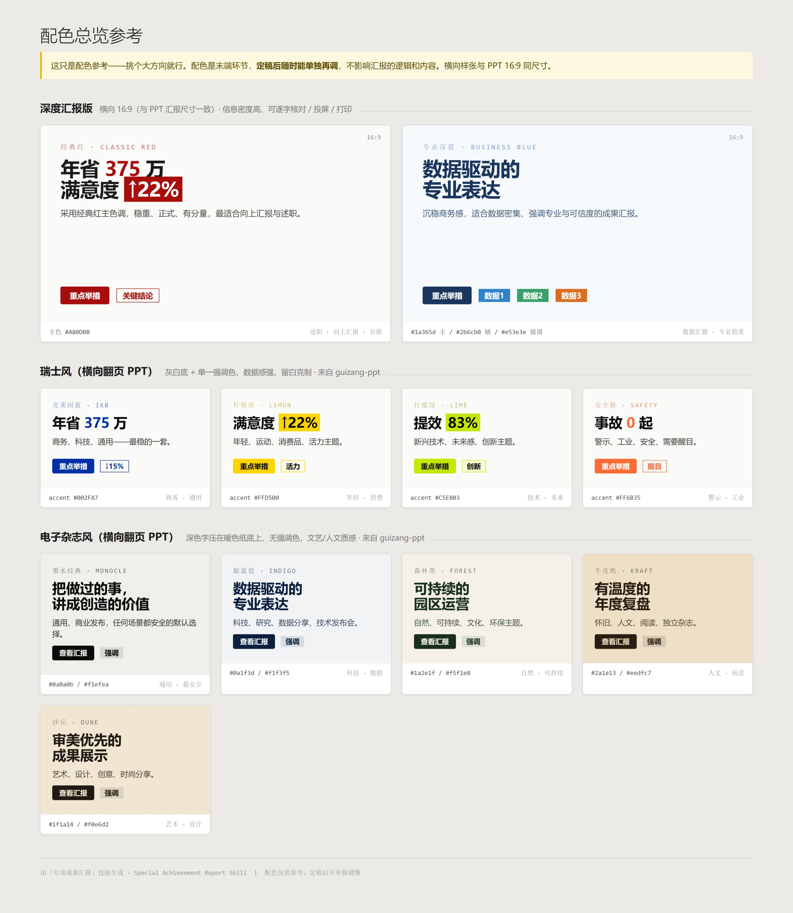

# 专项成果汇报 · Special Achievement Report

<p align="center">
  <a href="./LICENSE"></a>
  
  
  
  
</p>



<p align="center"><b>中文</b> · <a href="#english">English ↓</a></p>

> 一个让**任何人都能做出咨询公司级汇报**的 Claude 技能。
> 它的核心不是帮你排版 PPT，而是帮你把「我做了一堆事」**重组成「我创造了这些价值」**——用麦肯锡、BCG、贝恩、亚马逊等顶级机构的汇报方法论，把零散素材变成有逻辑、有洞见、领导记得住的成果汇报。

**不限行业、不限岗位、不需要任何技术基础。** 无论你是做行政、运营、HR、市场、销售、研发、财务、教师、医生还是个体创业——只要你需要「把成果讲清楚、讲漂亮」，它就帮得上。全程像一个资深汇报顾问坐在你旁边，一步步陪你把汇报理出来。

<p align="center"><i>「做得多」从来不等于「说得清」。这个技能，专治后者。</i></p>

---

## 🚀 30 秒上手（复制这句话，发给 Claude）

```
用专项成果汇报技能，帮我做一份 2025 年度工作成果汇报。
```

技能会像顾问一样和你聊几句（给谁看、你做了什么、有哪些数据），帮你理出汇报结构、生成大纲，最后再挑个好看的版式。**你只管说，它负责想。**

> 想更快出活，一句话带上素材就行：
> ```
> 用专项成果汇报技能：我是销售团队负责人，今年团队业绩涨了 40%、新签 28 个客户、
> 把回款周期从 90 天压到 60 天，帮我做一份给老板看的年终汇报。
> ```

---

## ✨ 它解决什么

很多人「事情做了一大堆，但汇报时讲不清价值」——领导听完没记住，自己也觉得亏。这个技能用方法论补上中间最难的那一环：

```
你：做了很多事，但说不清楚价值
        │  ← 用专业方法论重组（这一步才是关键）
技能：有逻辑、有数据、有洞见，领导记得住的成果汇报
```

**适用于任何需要「汇报成果」的场景：**
年终 / 季度总结 · 项目复盘 · 述职答辩 · 竞聘 · 争取预算资源 · 对外分享 · 投融资路演 · 课题结题 · 个人作品集……

**适用于任何角色：** 管理者、职能（行政/HR/财务/法务）、业务（销售/市场/运营）、技术、教育、医疗、个体创业者——汇报是通用刚需，方法论不挑行业。

---

## 🧠 九大类汇报方法论（按场景组合，不是只用一种）

真实汇报往往是几种方法叠加。技能会根据「给谁看、什么场合」**帮你配一套**，你也能加减、混搭。

| 大类 | 一句话 | 最适合 |
|------|--------|--------|
| **麦肯锡**（默认） | 金字塔 + MECE + SCQA + 空雨伞，9 种 / 3 子类组合 | 通用、向上汇报 |
| **BCG** | 每页标题就是结论 | 数据高光、要冲击力 |
| **Bain** | 答案先行、结果交付 | 争取认可、讲 ROI |
| **普华永道 PwC** | 事实-标准-差距-影响-建议 | 复盘 / 自查 / 风险 |
| **德勤 Deloitte** | 现状 → 目标 + 价值地图 | 转型 / 流程改造 |
| **亚马逊 Amazon** | 6 页叙事备忘 + PR/FAQ | 立项 / 深度论证 |
| **谷歌 Google** | OKR 复盘、目标打分归因 | 目标达成复盘 |
| **桥水 / 名人** | 信号-诊断-原则-行动 | 经验沉淀 / 复盘 |
| **金字塔之外** | BLUF / STAR / 故事弧 | 极短汇报 / 述职 / 演讲 |

> 不确定用哪套？直接说「按最稳妥的来」，技能默认用麦肯锡基线组合。

---

## 🎨 三种成品形态（内容定稿后才选，配色只是末端）

1. **深度汇报版** —— 横向 16:9 单页 HTML，信息密度高，适合细读 / 投屏 / 打印。
2. **电子杂志风 PPT** —— 横向翻页，文艺人文质感（来自 `guizang-ppt-skill`）。
3. **瑞士风 PPT** —— 横向翻页，网格 + 高反差色，数据感强（来自 `guizang-ppt-skill`）。

第一次选配色时，技能会在本地生成一张「配色总览参考」，让你直观挑，而不是凭文字想象。

---

## 🔄 它怎么陪你走（6 步，全程像聊天）

```
① 了解你    首次用，记下你的行业/岗位（只问一次，以后自动复用）
② 摸场景    这份给谁看？年终？述职？争资源？——决定怎么帮你讲
③ 给素材    你提供数据，或让它先帮你起草草稿（先问后写，不瞎编）
④ 配方法论  按场景帮你配一套方法论组合，生成大纲让你确认
⑤ 选形态    内容定稿后，挑个版式 + 配色（本地出配色参考直观选）
⑥ 出成品    生成单文件 HTML，并告诉你"5 分钟该讲哪 3 页、领导会追问什么"
```

## 💡 为什么用它，而不是直接让 AI 写

| 直接让 AI「写个年终总结」 | 用这个技能 |
|---|---|
| 流水账式罗列「做了什么」 | 用方法论提炼「创造了什么价值」 |
| 套话、AI 味重 | 像资深顾问聊出来的，去模板腔 |
| 一种写法到底 | 9 大类方法论按场景配，述职/复盘/争资源各不同 |
| 给你一坨文字 | 给你能直接投屏/打印的成品 + 讲法建议 |
| 数字含糊 | 数字必须来自你，缺的明确标 `【待填】`，绝不编造 |

---

## 📦 安装

技能目录统一放在 `~/.claude/skills/special-achievement-report`。任选一种方式：

### ⚡ 方式一：一行命令（推荐）

```bash
npx skills add https://github.com/xxxd666/special-achievement-report --skill special-achievement-report
```

### 🤖 方式二：把下面这段发给 AI（Claude Code / Cursor 等有 shell 权限的 Agent）

```
请帮我安装这个 Claude 技能：
1. 确保 ~/.claude/skills/ 目录存在（不存在就创建）
2. 执行 git clone https://github.com/xxxd666/special-achievement-report.git ~/.claude/skills/special-achievement-report
3. 验证：ls ~/.claude/skills/special-achievement-report/ 应能看到 SKILL.md 和 references/
```

### 🛠 方式三：手动命令行

```bash
git clone https://github.com/xxxd666/special-achievement-report.git ~/.claude/skills/special-achievement-report
```

> Windows 用户：`~/.claude/` 即 `C:\Users\<你的用户名>\.claude\`。

**验证**：装好后重启 Claude，发一句「用专项成果汇报技能帮我做份汇报」，能进入引导流程即成功。
**更新**：重跑安装命令，或在技能目录里执行 `git pull`。

---

## ⚠️ 关于网页 PPT 的依赖（重要）

- **深度汇报版（形态①）开箱即用**，不依赖任何其他东西。
- **电子杂志风 / 瑞士风 PPT（形态②③）** 复用了 `guizang-ppt-skill` 的模板与配色，需要**同级安装**它：
  ```
  .claude/skills/
  ├── special-achievement-report/   ← 本技能
  └── guizang-ppt-skill/            ← 网页 PPT 依赖（同级）
  ```
  仓库地址：**https://github.com/op7418/guizang-ppt-skill**（按其说明自行安装即可）
- 没装也没关系——技能会自动建议你用**深度汇报版**，照样能产出完整汇报。

---

## 🗂 项目结构

```
special-achievement-report/
├── SKILL.md                      技能主文档（两条核心原则 + 工作流）
└── references/
    ├── frameworks.md             九大类方法论总索引
    ├── framework-selector.md     方法论选择 / 推荐逻辑
    ├── palette-preview.md        配色总览参考的生成规范
    ├── ppt-styles.md             三种形态 + 版式映射
    ├── html-template.md          深度汇报版设计系统
    ├── ppt-output.md             传统 .pptx 兜底导出
    ├── examples.md               话术 / 案例库
    └── frameworks/               九大类方法论详解（各一文件）
        ├── mckinsey.md  bcg.md  bain.md  pwc.md  deloitte.md
        └── amazon.md  google-okr.md  bridgewater.md  beyond-pyramid.md
```

> 用户画像存在技能目录**之外**（`~/.claude/special-achievement-report.profile.md`），重装技能不会丢，可手动编辑。

---

## 🔒 两条设计原则

1. **卖点是汇报思维，不是配色。** 功夫都花在「怎么把价值讲清楚」，视觉是末端、可随时单独再调。
2. **去 AI 味。** 全程像资深顾问聊天，不堆术语、不机械走流程。

---

## 📸 截图

**配色总览参考**（首次选配色时本地生成，让你直观挑）：



> 更多截图说明与社交预览图设置见 [`docs/screenshots/`](./docs/screenshots/)。仓库自带可一键截图的 banner：[`docs/banner.html`](./docs/banner.html)。

---

## 🙏 致谢 / 出处

- 网页 PPT 模板与配色来自 [`guizang-ppt-skill`](https://github.com/op7418/guizang-ppt-skill)。
- 方法论参考自麦肯锡、BCG、贝恩、普华永道、德勤、亚马逊、谷歌、桥水等公开出版的汇报/沟通方法。

## License

[MIT](./LICENSE) © 2026 许吉伊

---
---

<a id="english"></a>

# Special Achievement Report

> A Claude skill that lets **anyone produce consulting-grade achievement reports**.
> Its core isn't laying out slides — it's turning *"I did a lot of things"* into *"here's the value I created"*, using the reporting methodologies of McKinsey, BCG, Bain, Amazon and more to reshape scattered material into a logical, insightful report your leadership will actually remember.

**Any industry, any role, zero technical background required.** Whether you're in operations, HR, sales, marketing, R&D, finance, teaching, healthcare, or running your own thing — if you need to *make your results clear and compelling*, this helps. It works like a senior reporting advisor sitting next to you, walking you through it step by step.

<p align="center"><i>"Doing a lot" never equals "saying it well." This skill fixes the latter.</i></p>

## 🚀 Get started in 30 seconds (copy this to Claude)

```
Use the special achievement report skill to help me build my 2025 annual results report.
```

It chats with you like an advisor (who's it for, what you did, what data you have), structures your report, drafts an outline, then picks a clean visual format. **You talk, it thinks.**

## ✨ What it solves

Many people "did tons of work but can't articulate the value" — leadership doesn't remember it, and you feel shortchanged. This skill fills the hardest gap in the middle:

```
You:   did lots of things, but can't explain the value
        │  ← reorganize with proven methodology (this is the key step)
Skill: a logical, data-backed, insightful report leadership remembers
```

Fits **any results-reporting scenario**: annual/quarterly reviews, project retros, job defenses, promotions, budget/resource asks, external sharing, investor pitches, research wrap-ups, portfolios…

## 🧠 Nine families of reporting methodology (combined by scenario, not just one)

Real reports stack several methods. The skill **configures a combination** based on "who's it for, what's the occasion" — and you can add, drop, or mix.

| Family | In a nutshell | Best for |
|--------|---------------|----------|
| **McKinsey** (default) | Pyramid + MECE + SCQA + Air-Rain-Umbrella; 9 methods / 3 subgroups | General, upward reporting |
| **BCG** | Every slide title *is* the conclusion (action titles) | Data highlights, impact |
| **Bain** | Answer first, results delivered | Winning buy-in, ROI |
| **PwC** | Fact – Criteria – Gap – Impact – Recommendation | Retro / self-audit / risk |
| **Deloitte** | As-Is → To-Be + value map | Transformation / process redesign |
| **Amazon** | 6-pager narrative memo + PR/FAQ | New initiatives / deep cases |
| **Google** | OKR review: objective–key results–scoring–attribution | Goal-attainment reviews |
| **Bridgewater / notables** | Signal – Diagnosis – Principle – Action | Lessons & experience distillation |
| **Beyond the pyramid** | BLUF / STAR / story arc | Ultra-short / job defense / talks |

> Not sure which? Just say "go with the safest option" — it defaults to the McKinsey baseline combination.

## 🎨 Three output formats (chosen only after content is final; color is the last mile)

1. **Deep report** — landscape 16:9 single-page HTML, dense, for close reading / projection / print.
2. **Editorial-magazine PPT** — horizontal deck, literary/humanistic feel (via `guizang-ppt-skill`).
3. **Swiss-style PPT** — horizontal deck, grid + high-contrast color, data-forward (via `guizang-ppt-skill`).

The first time you pick colors, the skill generates a local "palette overview" so you choose visually instead of imagining from text.

## 🔄 How it walks you through it (6 steps, all conversational)

```
① Get to know you   On first use, note your industry/role (asked once, reused after)
② Read the room     Who's it for? Annual? Defense? Resource ask?
③ Gather material   You provide data, or it drafts first (asks before writing, never fabricates)
④ Configure methods Pick a methodology combo by scenario; generate an outline to confirm
⑤ Choose format     After content is locked, pick layout + color (local palette preview)
⑥ Deliver           Single-file HTML + "which 3 pages to present in 5 min, likely questions"
```

## 💡 Why this instead of just asking AI to "write a summary"

| Just asking AI to "write a year-end summary" | Using this skill |
|---|---|
| A flat list of "what I did" | Distills "what value I created" via methodology |
| Generic, AI-flavored prose | Sounds like a senior advisor — no template tone |
| One style throughout | 9 method families matched to the occasion |
| A wall of text | A ready-to-project/print deliverable + talking points |
| Vague numbers | Numbers come from you; gaps marked `【TBD】`, never fabricated |

## 📦 Install

The skill lives at `~/.claude/skills/special-achievement-report`. Pick any method:

**① One-line command (recommended)**
```bash
npx skills add https://github.com/xxxd666/special-achievement-report --skill special-achievement-report
```

**② Paste this to an AI agent** (Claude Code / Cursor / any agent with shell access)
```
Please install this Claude skill:
1. Ensure ~/.claude/skills/ exists (create it if not)
2. Run: git clone https://github.com/xxxd666/special-achievement-report.git ~/.claude/skills/special-achievement-report
3. Verify: ls ~/.claude/skills/special-achievement-report/ should show SKILL.md and references/
```

**③ Manual clone**
```bash
git clone https://github.com/xxxd666/special-achievement-report.git ~/.claude/skills/special-achievement-report
```

> Windows: `~/.claude/` means `C:\Users\<you>\.claude\`.

**Verify:** restart Claude and say "use the special achievement report skill to build a report." **Update:** re-run the install command, or `git pull` in the skill folder.

## ⚠️ About the web-PPT dependency

- **Deep report (format ①) works out of the box** — no dependency.
- **Editorial / Swiss PPT (formats ②③)** reuse templates and palettes from `guizang-ppt-skill`, installed **as a sibling**:
  ```
  .claude/skills/
  ├── special-achievement-report/   ← this skill
  └── guizang-ppt-skill/            ← web-PPT dependency (sibling)
  ```
  Repo: **https://github.com/op7418/guizang-ppt-skill** (install per its own instructions)
- Skip it if you like — the skill falls back to the deep report and still produces a full report.

## 🔒 Two design principles

1. **The value is reporting *thinking*, not color.** Effort goes into making the value clear; visuals are the last mile, adjustable anytime.
2. **No "AI flavor."** It talks like a senior advisor — no jargon dumps, no robotic step-walking.

## 🙏 Credits

- Web-PPT templates and palettes from [`guizang-ppt-skill`](https://github.com/op7418/guizang-ppt-skill).
- Methodologies reference publicly published reporting/communication methods from McKinsey, BCG, Bain, PwC, Deloitte, Amazon, Google, Bridgewater, and others.

## License

[MIT](./LICENSE) © 2026 Xu Jiyi
